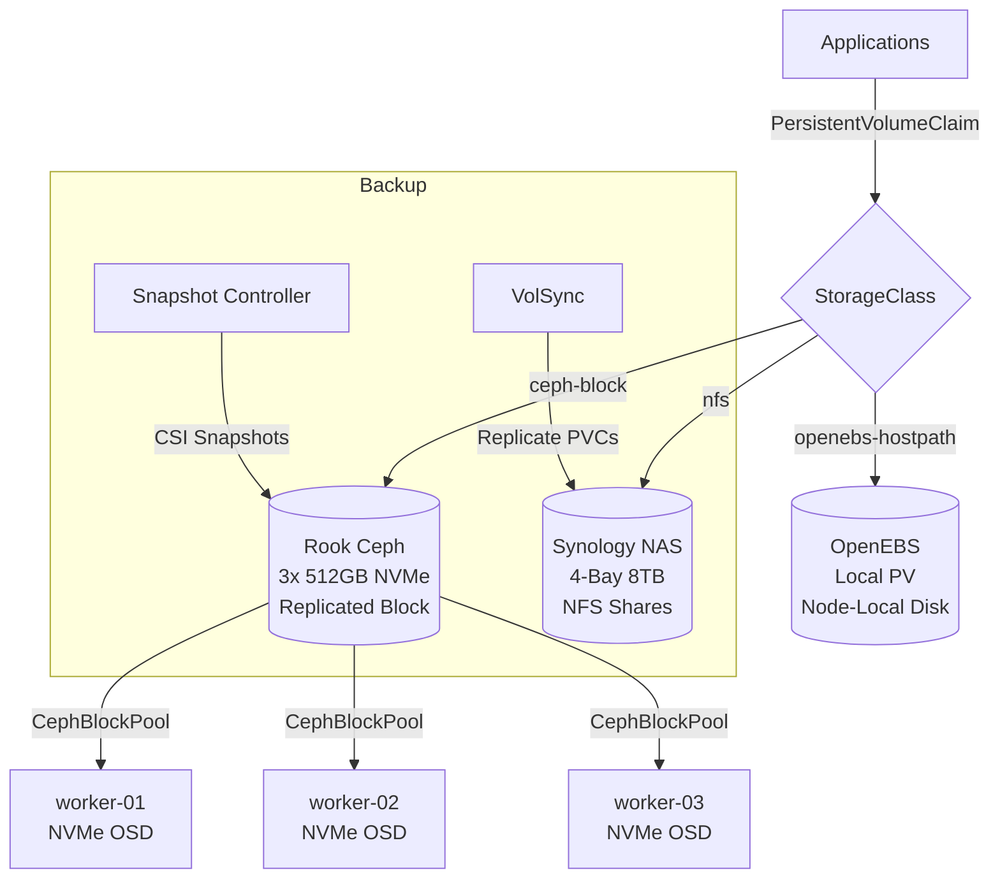

# Storage

The cluster uses a layered storage architecture to match workload requirements with the right storage backend. Distributed block storage, node-local volumes, and NAS-backed NFS mounts each serve a distinct purpose.

## Architecture

## Storage Classes

| StorageClass | Provider | Replicated | Use Case |
|:-------------|:---------|:----------:|:---------|
| `ceph-block` | Rook Ceph | Yes (3x) | General-purpose workloads requiring high availability |
| `openebs-hostpath` | OpenEBS | No | Databases and workloads needing low-latency local disk |
| NFS (manual) | Synology NAS | RAID | Bulk media storage, shared datasets, backup targets |

## When to Use Each

!!! tip "Choosing a StorageClass"

    - **Rook Ceph** -- Default choice for most workloads. Data is replicated across three NVMe drives on separate nodes, surviving single-node failures. Use for application databases, config volumes, and anything that needs to survive rescheduling.

    - **OpenEBS** -- Best for workloads that manage their own replication (e.g., PostgreSQL with CloudNativePG, etcd) or need the lowest possible latency. Data lives on a single node and is **not** replicated by the storage layer.

    - **Synology NFS** -- Ideal for large media libraries, bulk file storage, and backup destinations. Mounted via NFS from the 4-bay Synology NAS with 8 TB of usable storage.

## Components

| Component | Namespace | Purpose |
|:----------|:----------|:--------|
| [Rook Ceph](rook-ceph.md) | `rook-ceph` | Distributed block storage on NVMe drives |
| [OpenEBS](openebs.md) | `openebs` | Local PV provisioner for node-local storage |
| [VolSync](backup-restore.md#volsync) | `system` | PVC backup and replication |
| [Snapshot Controller](backup-restore.md#snapshot-controller) | `system` | CSI volume snapshots |

## Sections

| Page | Description |
|:-----|:------------|
| [Rook Ceph](rook-ceph.md) | Distributed Ceph cluster on NVMe -- operator, cluster config, storage classes |
| [OpenEBS](openebs.md) | Local PV provisioner for node-local volumes |
| [Backup & Restore](backup-restore.md) | VolSync replication, CSI snapshots, Synology backup targets, restore procedures |
