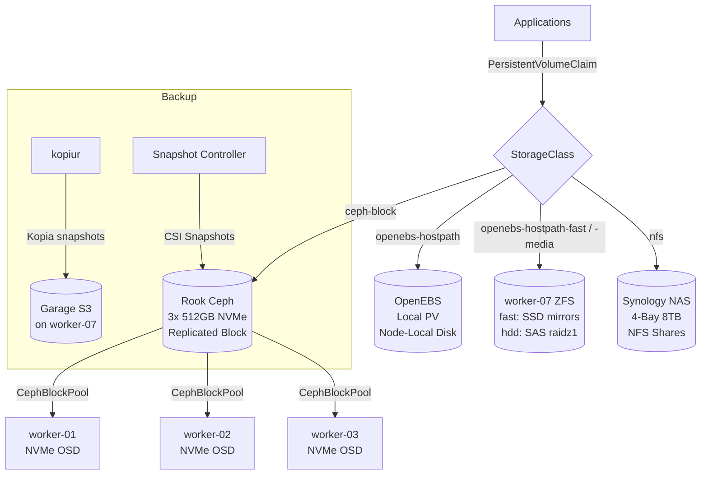

# Storage

The cluster uses a layered storage architecture to match workload requirements with the right storage backend. Distributed block storage, node-local volumes, and NAS-backed NFS mounts each serve a distinct purpose.

## Architecture

```mermaid
flowchart TD
    Apps[Applications] -->|PersistentVolumeClaim| SC{StorageClass}

    SC -->|ceph-block| RC[(Rook Ceph\n3x 512GB NVMe\nReplicated Block)]
    SC -->|openebs-hostpath| OE[(OpenEBS\nLocal PV\nNode-Local Disk)]
    SC -->|openebs-hostpath-fast / -media| ZFS[(worker-07 ZFS\nfast: SSD mirrors\nhdd: SAS raidz1)]
    SC -->|nfs| SYN[(Synology NAS\n4-Bay 8TB\nNFS Shares)]

    RC -->|CephBlockPool| OSD1[worker-01\nNVMe OSD]
    RC -->|CephBlockPool| OSD2[worker-02\nNVMe OSD]
    RC -->|CephBlockPool| OSD3[worker-03\nNVMe OSD]

    subgraph Backup
        KOP[kopiur] -->|Kopia snapshots| GAR[(Garage S3\non worker-07)]
        SNAP[Snapshot Controller] -->|CSI Snapshots| RC
    end
```

## Storage Classes

| StorageClass | Provider | Replicated | Use Case |
|:-------------|:---------|:----------:|:---------|
| `ceph-block` | Rook Ceph | Yes (3x) | General-purpose workloads requiring high availability |
| `openebs-hostpath` | OpenEBS | No | Databases and workloads needing low-latency local disk (every node except worker-07) |
| `openebs-hostpath-fast` | OpenEBS on worker-07 `fast/extra` | ZFS mirrors | Workloads pinned to worker-07 (monitoring TSDBs, media apps) |
| `openebs-hostpath-runners` | OpenEBS on worker-07 `fast/runners` | ZFS mirrors | amd64 CI runner scratch, quota-bounded together |
| `openebs-hostpath-media` | OpenEBS on worker-07 `hdd/media` | ZFS raidz1 | Immich photo library (Retain) |
| `openebs-hostpath-models` | OpenEBS on worker-ai-01 NVMe | No | LLM weights and AI scratch |
| NFS (manual) | Synology NAS | RAID | Bulk media storage, shared datasets, backup targets |

## When to Use Each

!!! tip "Choosing a StorageClass"

    - **Rook Ceph** -- Default choice for most workloads. Data is replicated across three NVMe drives on separate nodes, surviving single-node failures. Use for application databases, config volumes, and anything that needs to survive rescheduling.

    - **OpenEBS** -- Best for workloads that manage their own replication (e.g., PostgreSQL with CloudNativePG, etcd) or need the lowest possible latency. Data lives on a single node and is **not** replicated by the storage layer.

    - **Synology NFS** -- Ideal for large media libraries, bulk file storage, and backup destinations. Mounted via NFS from the 4-bay Synology NAS with 8 TB of usable storage.

## Components

| Component | Namespace | Purpose |
|:----------|:----------|:--------|
| [Rook Ceph](rook-ceph.md) | `rook-ceph` | Distributed block storage on NVMe drives |
| [OpenEBS](openebs.md) | `openebs` | Local PV provisioner for node-local storage |
| [kopiur](backup-restore.md#kopiur) | `kopiur-system` | PVC snapshots (Kopia) to Garage |
| [Snapshot Controller](backup-restore.md#snapshot-controller) | `system` | CSI volume snapshots |
| [Garage S3](garage.md) | `system` | S3-compatible object store on worker-07's ZFS pools |

## Sections

| Page | Description |
|:-----|:------------|
| [Rook Ceph](rook-ceph.md) | Distributed Ceph cluster on NVMe -- operator, cluster config, storage classes |
| [OpenEBS](openebs.md) | Local PV provisioner for node-local volumes |
| [Garage S3](garage.md) | S3-compatible object store (backup target for kopiur and CNPG) -- setup, usage, and operations |
| [Backup & Restore](backup-restore.md) | kopiur and CNPG backups to Garage, CSI snapshots, restore procedures, what is not backed up |
