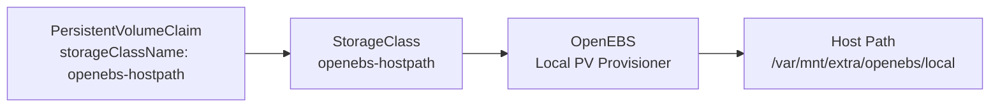

# OpenEBS

[OpenEBS](https://openebs.io/) provides a local PV (Persistent Volume) provisioner for the cluster. It creates hostpath-backed persistent volumes that store data directly on the node's local filesystem -- no replication, no network overhead.

## Architecture



## When to Use OpenEBS

OpenEBS local PVs are best suited for workloads that:

- **Manage their own replication** -- databases like PostgreSQL (via CloudNativePG) or Redis that handle data replication at the application level
- **Need low-latency local I/O** -- workloads where network storage overhead is unacceptable
- **Are tolerant of node affinity** -- pods using local PVs are bound to the node where the volume was created

!!! warning "No replication"
    Data stored on OpenEBS local PVs exists only on a single node. If that node fails, the data is unavailable until the node recovers. Always ensure application-level replication or backups for critical data.

## Configuration

### Namespace

The OpenEBS namespace requires privileged Pod Security Standards since the provisioner needs host filesystem access:

```yaml title="namespace.yaml"
apiVersion: v1
kind: Namespace
metadata:
  name: openebs
  labels:
    pod-security.kubernetes.io/enforce: privileged
    pod-security.kubernetes.io/audit: privileged
    pod-security.kubernetes.io/warn: privileged
```

### Helm Chart

OpenEBS is deployed via the official Helm chart (v4.4.0) with only the local PV provisioner enabled:

```yaml title="values.yaml"
localpv-provisioner:
  rbac:
    create: true
  localpv:
    image:
      registry: quay.io/
      repository: openebs/provisioner-localpv
    basePath: &hostPath /var/mnt/extra/openebs/local
  hostpathClass:
    enabled: true
    name: openebs-hostpath
    isDefaultClass: false
    basePath: *hostPath

# All other engines are disabled
openebs-crds:
  csi:
    volumeSnapshots:
      enabled: false
      keep: false
zfs-localpv:
  enabled: false
lvm-localpv:
  enabled: false
mayastor:
  enabled: false
engines:
  local:
    lvm:
      enabled: false
    zfs:
      enabled: false
  replicated:
    mayastor:
      enabled: false
```

Key settings:

| Setting | Value | Purpose |
|:--------|:------|:--------|
| `basePath` | `/var/mnt/extra/openebs/local` | Host directory where PVs are stored |
| `hostpathClass.name` | `openebs-hostpath` | StorageClass name for PVC requests |
| `hostpathClass.isDefaultClass` | `false` | Not the cluster default (Ceph is preferred) |
| `mayastor.enabled` | `false` | Replicated engine not needed (Rook Ceph fills this role) |
| `zfs-localpv.enabled` | `false` | No ZFS volumes on these nodes |
| `lvm-localpv.enabled` | `false` | No LVM volumes on these nodes |

!!! info "Minimal footprint"
    Only the `localpv-provisioner` component is active. All other OpenEBS engines (Mayastor, ZFS, LVM) are disabled to minimize resource usage and complexity.

## Usage

To request a local PV, set the `storageClassName` to `openebs-hostpath`:

```yaml
apiVersion: v1
kind: PersistentVolumeClaim
metadata:
  name: my-database-data
spec:
  accessModes:
    - ReadWriteOnce
  storageClassName: openebs-hostpath
  resources:
    requests:
      storage: 20Gi
```

!!! note "Node affinity"
    Once a pod is scheduled and a local PV is provisioned, the volume is tied to that specific node. The pod will always be scheduled on the same node as its volume. If the node is unavailable, the pod cannot start elsewhere unless the PV is manually recreated.

## Comparison with Rook Ceph

| Feature | OpenEBS (Local PV) | Rook Ceph |
|:--------|:-------------------|:----------|
| Replication | None | 3-way across nodes |
| Latency | Lowest (local disk) | Higher (network + replication) |
| Node failure tolerance | No (data on single node) | Yes (data survives 1 node loss) |
| Pod scheduling | Pinned to volume node | Can reschedule freely |
| Best for | Databases with app-level replication | General workloads |
| StorageClass | `openebs-hostpath` | `ceph-block` |
