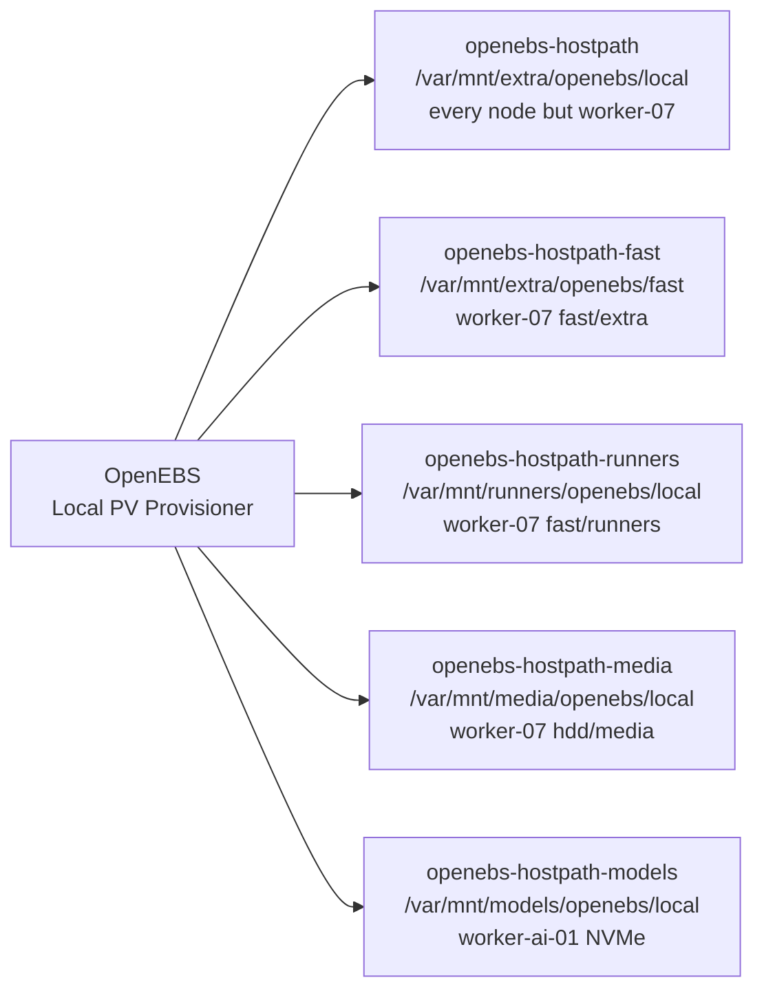

# OpenEBS

[OpenEBS](https://openebs.io/) provides a local PV (Persistent Volume) provisioner for the cluster. It creates hostpath-backed persistent volumes that store data directly on a node's local filesystem -- no replication, no network overhead.

## Architecture


```mermaid
flowchart LR
    PROV[OpenEBS\nLocal PV Provisioner]
    PROV --> HP[openebs-hostpath\n/var/mnt/extra/openebs/local\nevery node but worker-07]
    PROV --> FAST[openebs-hostpath-fast\n/var/mnt/extra/openebs/fast\nworker-07 fast/extra]
    PROV --> RUN[openebs-hostpath-runners\n/var/mnt/runners/openebs/local\nworker-07 fast/runners]
    PROV --> MEDIA[openebs-hostpath-media\n/var/mnt/media/openebs/local\nworker-07 hdd/media]
    PROV --> MODELS[openebs-hostpath-models\n/var/mnt/models/openebs/local\nworker-ai-01 NVMe]
```

## When to Use OpenEBS

OpenEBS local PVs are best suited for workloads that:

- **Manage their own replication** -- databases like PostgreSQL (via CloudNativePG) that handle data replication at the application level
- **Need low-latency local I/O** -- workloads where network storage overhead is unacceptable
- **Are tolerant of node affinity** -- pods using local PVs are bound to the node where the volume was created

> [!WARNING]
> **No replication**
>
> Data stored on OpenEBS local PVs exists only on a single node. If that node fails, the data is unavailable until the node recovers. kopiur only snapshots Ceph volumes, so hostpath data is not backed up by it (see [What is not backed up](backup-restore.md#what-is-not-backed-up)).

## Storage Classes

| StorageClass | Base path | Nodes | Reclaim | Per-PVC limit |
|:-------------|:----------|:------|:--------|:--------------|
| `openebs-hostpath` | `/var/mnt/extra/openebs/local` | every node except worker-07 | Delete | XFS project quota |
| `openebs-hostpath-fast` | `/var/mnt/extra/openebs/fast` | worker-07 (`fast/extra` ZFS dataset) | Delete | None; the dataset quota caps the total |
| `openebs-hostpath-runners` | `/var/mnt/runners/openebs/local` | worker-07 (`fast/runners` ZFS dataset) | Delete | None; the dataset quota bounds all runners together |
| `openebs-hostpath-media` | `/var/mnt/media/openebs/local` | worker-07 (`hdd/media` ZFS dataset) | **Retain** | None (one claim: the Immich library) |
| `openebs-hostpath-models` | `/var/mnt/models/openebs/local` | worker-ai-01 (`models` user volume) | Delete | XFS project quota |

All classes use `volumeBindingMode: WaitForFirstConsumer`. `openebs-hostpath` comes from the Helm values; the other four are plain StorageClass manifests in the app directory.

> [!NOTE]
> **Node restrictions**
>
> - `openebs-hostpath` uses `allowedTopologies` with an explicit node list (every node except worker-07, whose `/var/mnt/extra` is ZFS and cannot do XFS quotas). A new node has to be added to that list in `values.yaml`.
> - `-fast` and `-runners` carry `allowedTopologies` for worker-07, so a claim cannot land elsewhere.
> - `-media` and `-models` have no `allowedTopologies`; pair the consumer with a `nodeSelector` (or GPU request) that lands it on worker-07 or worker-ai-01.

> [!NOTE]
> **Sizes on ZFS are labels**
>
> On the worker-07 classes the PVC size is not enforced: the provisioner's XFS quota setup does not work on ZFS. Bound workloads by their own settings (for example Prometheus `retentionSize`) and by the ZFS dataset quota.

## Configuration

### Namespace

The `openebs` namespace runs with privileged Pod Security Standards since the provisioner needs host filesystem access.

### Helm Chart

OpenEBS is deployed via the official Helm chart (`4.6.1`) with only the local PV provisioner enabled:

```yaml title="values.yaml (abridged)"
localpv-provisioner:
  rbac:
    create: true
  localpv:
    image:
      registry: quay.io/
      repository: openebs/provisioner-localpv
    basePath: &hostPath /var/mnt/extra/openebs/local
  hostpathClass:
    enabled: true
    name: openebs-hostpath
    isDefaultClass: false
    basePath: *hostPath
    xfsQuota:
      enabled: true
    allowedTopologies:
      - matchLabelExpressions:
          - key: kubernetes.io/hostname
            values: [worker-01, worker-02, worker-03, worker-04, worker-05,
                     worker-06, worker-08, worker-09, worker-10, worker-ai-01]

zfs-localpv:
  enabled: false
lvm-localpv:
  enabled: false
mayastor:
  enabled: false
loki:
  enabled: false
alloy:
  enabled: false
```

Key settings:

| Setting | Value | Purpose |
|:--------|:------|:--------|
| `basePath` | `/var/mnt/extra/openebs/local` | Host directory where `openebs-hostpath` PVs are stored |
| `hostpathClass.isDefaultClass` | `false` | Not the cluster default (`ceph-block` is) |
| `hostpathClass.xfsQuota.enabled` | `true` | Enforces the requested size as a hard limit; needs the mount to carry `prjquota` |
| `mayastor.enabled` | `false` | Replicated engine not needed (Rook Ceph fills this role) |
| `zfs-localpv.enabled` / `lvm-localpv.enabled` | `false` | No ZFS/LVM CSI volumes; worker-07's ZFS datasets are used through hostpath |
| `loki.enabled` / `alloy.enabled` | `false` | The chart's bundled logging stack is not used |

> [!NOTE]
> **XFS quotas apply at provision time**
>
> PVCs created before `xfsQuota` was enabled stay unlimited until recreated.

## Usage

To request a local PV, set the `storageClassName`:

```yaml
apiVersion: v1
kind: PersistentVolumeClaim
metadata:
  name: my-database-data
spec:
  accessModes:
    - ReadWriteOnce
  storageClassName: openebs-hostpath
  resources:
    requests:
      storage: 20Gi
```

> [!NOTE]
> **Node affinity**
>
> Once a pod is scheduled and a local PV is provisioned, the volume is tied to that specific node. The pod will always be scheduled on the same node as its volume. If the node is unavailable, the pod cannot start elsewhere unless the PV is manually recreated.

## Comparison with Rook Ceph

| Feature | OpenEBS (Local PV) | Rook Ceph |
|:--------|:-------------------|:----------|
| Replication | None (ZFS redundancy on worker-07 only) | 3-way across nodes |
| Latency | Lowest (local disk) | Higher (network + replication) |
| Node failure tolerance | No (data on single node) | Yes (data survives 1 node loss) |
| Pod scheduling | Pinned to volume node | Can reschedule freely |
| CSI snapshots / kopiur | No | Yes |
| Best for | Databases with app-level replication, TSDBs, scratch | General workloads |
| StorageClass | `openebs-hostpath*` | `ceph-block` |
