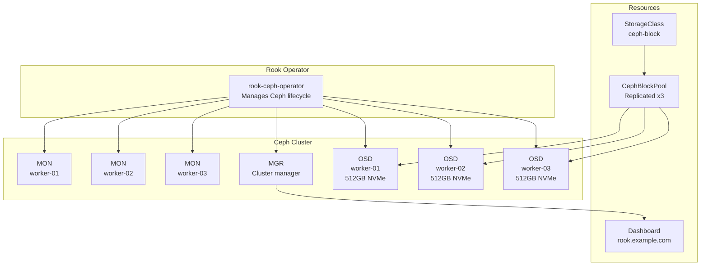

# Rook Ceph

[Rook Ceph](https://rook.io/) provides distributed block storage for the cluster. Three 512 GB NVMe drives on the Acemagician AM06 nodes form a Ceph cluster managed by the Rook operator, delivering replicated, high-availability persistent volumes.

## Architecture



## Repository Layout

The Rook Ceph deployment is split into three kustomization directories:

```
pitower/kubernetes/apps/rook-ceph/
├── operator/           # Rook operator Helm chart + CRDs
│   ├── kustomization.yaml
│   ├── namespace.yaml
│   └── values.yaml
├── cluster/            # CephCluster CR, dashboard HTTPRoute
│   ├── kustomization.yaml
│   ├── values.yaml
│   └── httproute.yaml
└── add-ons/            # Grafana dashboards for Ceph monitoring
    ├── kustomization.yaml
    └── dashboard/
        ├── kustomization.yaml
        ├── ceph-cluster-dashboard.json
        ├── ceph-osd-dashboard.json
        └── ceph-pools-dashboard.json
```

!!! info "Separation of concerns"
    The operator and cluster are deployed as separate ArgoCD applications. This allows the operator to be upgraded independently of the cluster, and prevents accidental cluster disruption during operator updates.

## Operator

The Rook operator is deployed via the `rook-ceph` Helm chart (v1.17.9) into the `rook-ceph` namespace:

```yaml title="operator/values.yaml"
crds:
  enabled: true
csi:
  enableCephfsDriver: false
monitoring:
  enabled: false
resources:
  requests:
    memory: 128Mi
    cpu: 100m
  limits: {}
```

Key decisions:

- **CephFS driver disabled** -- the cluster uses block storage only (`cephFileSystems: []`)
- **CRDs managed by the chart** -- `crds.enabled: true` ensures CRDs are installed and upgraded with the operator

## Cluster Configuration

The `rook-ceph-cluster` Helm chart deploys the `CephCluster` custom resource:

### Monitors and Managers

| Component | Count | Purpose |
|:----------|:-----:|:--------|
| MON | 3 | Maintain cluster map consensus (one per node) |
| MGR | 1 | Cluster management, dashboard, metrics |
| OSD | 3 | One per NVMe drive, stores actual data |

### Storage Nodes

Each OSD is pinned to a specific NVMe device by disk ID to prevent accidental data loss:

```yaml title="cluster/values.yaml (storage section)"
cephClusterSpec:
  storage:
    useAllNodes: false
    useAllDevices: false
    config:
      osdsPerDevice: "1"
    nodes:
      - name: "worker-01"
        devices:
          - name: "/dev/disk/by-id/nvme-AirDisk_512GB_SSD_NFQ0044006866P70GX"
      - name: "worker-02"
        devices:
          - name: "/dev/disk/by-id/nvme-AirDisk_512GB_SSD_NFQ0044007344P70GX"
      - name: "worker-03"
        devices:
          - name: "/dev/disk/by-id/nvme-AirDisk_512GB_SSD_NFQ0044010702P70GX"
```

!!! warning "Device selection"
    `useAllNodes` and `useAllDevices` are both set to `false`. Each node and device is explicitly listed to prevent Ceph from consuming unintended disks. Devices are referenced by `/dev/disk/by-id/` paths for stability across reboots.

### Network

```yaml
cephClusterSpec:
  network:
    provider: host
```

Host networking is used for Ceph daemons to maximize throughput and minimize latency between OSDs and monitors.

### Resource Limits

| Daemon | CPU Request | Memory Request | Memory Limit |
|:-------|:------------|:---------------|:-------------|
| MGR | 125m | 512Mi | 2Gi |
| MON | 49m | 512Mi | 1Gi |
| OSD | 442m | 1Gi | 6Gi |
| MGR Sidecar | 49m | 128Mi | 256Mi |
| Crash Collector | 15m | 64Mi | 64Mi |
| Log Collector | 100m | 100Mi | 1Gi |

## Storage Resources

### CephBlockPool

The default block pool provides three-way replication across the three OSD nodes. This is configured through the `rook-ceph-cluster` Helm chart's defaults.

!!! note "Current configuration"
    - `cephFileSystems: []` -- No CephFS filesystems are deployed
    - `cephObjectStores: []` -- No S3-compatible object stores are deployed
    - `cephBlockPoolsVolumeSnapshotClass.enabled: false` -- Volume snapshot class for block pools is not yet enabled

### StorageClass

The Helm chart creates a `ceph-block` StorageClass that provisions RBD (RADOS Block Device) volumes from the block pool. Applications request storage through PVCs referencing this class:

```yaml
apiVersion: v1
kind: PersistentVolumeClaim
metadata:
  name: my-app-data
spec:
  accessModes:
    - ReadWriteOnce
  storageClassName: ceph-block
  resources:
    requests:
      storage: 10Gi
```

## Dashboard

The Ceph dashboard is enabled and accessible via the internal gateway:

```yaml title="cluster/httproute.yaml"
apiVersion: gateway.networking.k8s.io/v1
kind: HTTPRoute
metadata:
  name: rook-ceph-dashboard
  namespace: rook-ceph
spec:
  hostnames:
    - rook.example.com
  parentRefs:
    - name: envoy-internal
      namespace: networking
      sectionName: https
  rules:
    - backendRefs:
        - name: rook-ceph-mgr-dashboard
          port: 7000
```

Access the dashboard at `https://rook.example.com` from the internal network or via Tailscale VPN.

!!! tip "Dashboard credentials"
    The dashboard admin password is stored in the `rook-ceph-dashboard-password` secret in the `rook-ceph` namespace:

    ```bash
    kubectl -n rook-ceph get secret rook-ceph-dashboard-password \
      -o jsonpath='{.data.password}' | base64 -d
    ```

## Monitoring

### Grafana Dashboards

Three Grafana dashboards are deployed as ConfigMaps with the `grafana_dashboard: "true"` label, automatically discovered by the Grafana sidecar:

| Dashboard | Grafana ID | Purpose |
|:----------|:-----------|:--------|
| Ceph Cluster | 2842 | Overall cluster health, IOPS, throughput |
| Ceph OSD | 5336 | Per-OSD performance and utilization |
| Ceph Pools | 5342 | Pool-level statistics and capacity |

### Toolbox

The Rook toolbox pod is enabled (`toolbox.enabled: true`) for interactive Ceph CLI troubleshooting:

```bash
kubectl -n rook-ceph exec -it deploy/rook-ceph-tools -- bash

# Inside the toolbox
ceph status
ceph osd status
ceph df
rados df
```

## Health Checks

Common commands to verify Ceph cluster health:

=== "Quick Status"

    ```bash
    kubectl -n rook-ceph exec deploy/rook-ceph-tools -- ceph status
    ```

=== "OSD Tree"

    ```bash
    kubectl -n rook-ceph exec deploy/rook-ceph-tools -- ceph osd tree
    ```

=== "Pool Usage"

    ```bash
    kubectl -n rook-ceph exec deploy/rook-ceph-tools -- ceph df
    ```

=== "PG Status"

    ```bash
    kubectl -n rook-ceph exec deploy/rook-ceph-tools -- ceph pg stat
    ```

!!! danger "Data safety"
    The `cleanupPolicy.confirmation` field is left empty (`""`). Setting it to `"yes-really-destroy-data"` would allow the cleanup job to wipe all Ceph data when the CephCluster resource is deleted. Never change this unless you are intentionally decommissioning the cluster.
