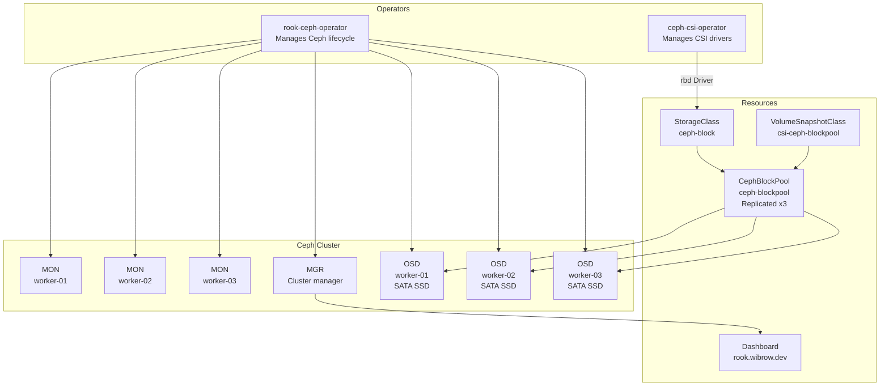

# Rook Ceph

[Rook Ceph](https://rook.io/) provides distributed block storage for the cluster. Three SATA SSDs, one in each control-plane node (worker-01/02/03), form a Ceph cluster managed by the Rook operator. `ceph-block` is the cluster's default StorageClass.

## Architecture


```mermaid
flowchart TD
    subgraph Operators
        OP[rook-ceph-operator\nManages Ceph lifecycle]
        CSIOP[ceph-csi-operator\nManages CSI drivers]
    end

    subgraph Ceph Cluster
        MON1[MON\nworker-01]
        MON2[MON\nworker-02]
        MON3[MON\nworker-03]
        MGR[MGR\nCluster manager]
        OSD1[OSD\nworker-01\nSATA SSD]
        OSD2[OSD\nworker-02\nSATA SSD]
        OSD3[OSD\nworker-03\nSATA SSD]
    end

    subgraph Resources
        BP[CephBlockPool\nceph-blockpool\nReplicated x3]
        SC[StorageClass\nceph-block]
        VSC[VolumeSnapshotClass\ncsi-ceph-blockpool]
        DASH[Dashboard\nrook.wibrow.dev]
    end

    OP --> MON1 & MON2 & MON3
    OP --> MGR
    OP --> OSD1 & OSD2 & OSD3
    BP --> OSD1 & OSD2 & OSD3
    SC --> BP
    VSC --> BP
    CSIOP -->|rbd Driver| SC
    MGR --> DASH
```

## Repository Layout

The deployment is split into four directories under `kubernetes/apps/pitower/rook-ceph/`, each its own ArgoCD application:

```
kubernetes/apps/pitower/rook-ceph/
├── operator/      # rook-ceph chart: operator, CRDs, ceph-csi-operator
├── csi-drivers/   # ceph-csi-drivers chart: OperatorConfig + rbd Driver CR
├── cluster/       # rook-ceph-cluster chart: CephCluster, pool, StorageClass, dashboard HTTPRoute
└── add-ons/       # Ceph Grafana dashboards (GrafanaDashboard CRs)
```

> [!NOTE]
> **Separation of concerns**
>
> The operator and cluster are separate ArgoCD applications, so the operator can be upgraded independently of the cluster. Renovate never auto-merges Rook updates.

## Operator

The Rook operator is deployed via the `rook-ceph` Helm chart (`v1.20.8`) into the `rook-ceph` namespace:

```yaml title="operator/values.yaml (abridged)"
image:
  repository: ghcr.io/rook/ceph
crds:
  enabled: true
monitoring:
  enabled: true
nodeSelector: &cephControllerNodes
  node-role.kubernetes.io/control-plane: ""
ceph-csi-operator:
  controllerManager:
    nodeSelector: *cephControllerNodes
```

Key decisions:

- **CRDs managed by the chart**: `crds.enabled: true` installs and upgrades the CRDs with the operator.
- **`monitoring.enabled: true`**: grants the operator RBAC to create the `rook-ceph-mgr` / `rook-ceph-exporter` ServiceMonitors and PrometheusRules. Without it no `ceph_*` metrics are scraped.
- **Controllers stay on the OSD hosts**: the chart only exposes `nodeSelector`, so the operator and ceph-csi-operator ride the control-plane role label (today exactly worker-01/02/03).

## CSI Drivers

Since Rook v1.20 the operator chart no longer configures the CSI drivers; the `ceph-csi-operator` does. `csi-drivers/` deploys the `ceph-csi-drivers` chart (`1.1.0`), which renders the `OperatorConfig` and the `rbd` `Driver` CR:

- Only **RBD** is enabled; CephFS, NFS and NVMe-oF drivers are disabled.
- The RBD node plugin tolerates every `dedicated=*` taint, so volumes can mount wherever pods land.
- The controller plugin (provisioner, attacher, snapshotter, resizer) runs 2 replicas pinned to worker-01/02/03.
- `CephConnection` / `ClientProfile` CRs are left to Rook, which owns the live `rook-ceph` ones.

## Cluster Configuration

The `rook-ceph-cluster` Helm chart (`v1.20.8`) deploys the `CephCluster` custom resource.

### Monitors and Managers

| Component | Count | Purpose |
|:----------|:-----:|:--------|
| MON | 3 | Maintain cluster map consensus (one per node) |
| MGR | 1 | Cluster management, dashboard, metrics |
| OSD | 3 | One per SSD, stores actual data |

### Placement

`placement.all` pins every Ceph daemon to worker-01/02/03 and tolerates the `node-issue` and `dedicated=storage` taints. The toolbox is a chart-owned Deployment, so it carries the same node affinity separately.

> [!WARNING]
> **Moving mons**
>
> Never narrow the placement list by more than one mon's node at a time. Each mon is nodeSelector-pinned to the node it was created on, so excluding two nodes at once leaves two mons unschedulable and loses quorum. The procedure used for the 2026-07-26 migration off worker-05/06/07 is documented in the comments of `cluster/values.yaml`.

### Storage Nodes

Each OSD is pinned to a specific device by disk ID:

```yaml title="cluster/values.yaml (storage section)"
cephClusterSpec:
  storage:
    useAllNodes: false
    useAllDevices: false
    config:
      osdsPerDevice: "1"
    nodes:
      - name: "worker-01"
        devices:
          - name: "/dev/disk/by-id/ata-SanDisk_SD7SB2Q512G1001_153141400183"
      - name: "worker-02"
        devices:
          - name: "/dev/disk/by-id/ata-Samsung_SSD_850_EVO_500GB_S21JNSAG160704R"
      - name: "worker-03"
        devices:
          - name: "/dev/disk/by-id/ata-KINGSTON_SA400S37480G_50026B7384393346"
```

> [!WARNING]
> **Device selection**
>
> `useAllNodes` and `useAllDevices` are both `false`. Each node and device is listed explicitly so Ceph never consumes an unintended disk. Devices are referenced by `/dev/disk/by-id/` paths for stability across reboots.

### Network

```yaml
cephClusterSpec:
  network:
    provider: host
```

Host networking is used for Ceph daemons to maximize throughput and minimize latency between OSDs and monitors.

### cephx Key Rotation

Daemon keys are rotated with `security.cephx.daemon.keyRotationPolicy: KeyGeneration`; bump `keyGeneration` to rotate. Rook rolls the daemons one at a time, so the pool must be `active+clean` first. The CSI client keys deliberately stay on `aes` until every node runs a Linux kernel >= 7.0; the reasoning and the muted health checks are documented in `cluster/values.yaml`.

### Resource Limits

| Daemon | CPU Request | Memory Request | Memory Limit |
|:-------|:------------|:---------------|:-------------|
| MGR | 73m | 283Mi | 2Gi |
| MON | 30m | 512Mi | 1Gi |
| OSD | 48m | 1Gi | 6Gi |
| MGR Sidecar | 49m | 128Mi | 256Mi |
| Crash Collector | 15m | 7Mi | 64Mi |
| Log Collector | 25m | 100Mi | 1Gi |

## Storage Resources

### CephBlockPool

The chart's default `ceph-blockpool` pool replicates three ways with `host` as the failure domain, so each OSD node holds one copy.

> [!NOTE]
> **Current configuration**
>
> - `cephFileSystems: []`: no CephFS filesystems
> - `cephObjectStores: []`: no Ceph object stores (S3 is provided by [Garage](garage.md))
> - `cephBlockPoolsVolumeSnapshotClass.enabled: true`: the `csi-ceph-blockpool` VolumeSnapshotClass, used by kopiur and for [manual snapshots](backup-restore.md#csi-snapshots)

### StorageClass

The chart creates the `ceph-block` StorageClass (the cluster default) that provisions RBD volumes from the pool:

```yaml
apiVersion: v1
kind: PersistentVolumeClaim
metadata:
  name: my-app-data
spec:
  accessModes:
    - ReadWriteOnce
  storageClassName: ceph-block
  resources:
    requests:
      storage: 10Gi
```

## Dashboard

The Ceph dashboard is enabled and exposed via the internal gateway:

```yaml title="cluster/httproute.yaml"
apiVersion: gateway.networking.k8s.io/v1
kind: HTTPRoute
metadata:
  name: rook-ceph-dashboard
  namespace: rook-ceph
spec:
  hostnames:
    - rook.wibrow.dev
  parentRefs:
    - name: envoy-internal
      namespace: networking
      sectionName: https
  rules:
    - backendRefs:
        - name: rook-ceph-mgr-dashboard
          port: 7000
```

Access the dashboard at `https://rook.wibrow.dev` from the LAN or via Tailscale.

> [!TIP]
> **Dashboard credentials**
>
> The dashboard admin password is stored in the `rook-ceph-dashboard-password` secret in the `rook-ceph` namespace:
>
> ```bash
> kubectl -n rook-ceph get secret rook-ceph-dashboard-password \
>   -o jsonpath='{.data.password}' | base64 -d
> ```

## Monitoring

The cluster chart sets `monitoring.enabled: true` and `createPrometheusRules: true`, so Prometheus scrapes the mgr and exporter and the stock Ceph alert rules are installed.

### Grafana Dashboards

`add-ons/dashboard/` ships three dashboard JSON files as ConfigMaps, each referenced by a `GrafanaDashboard` CR in the **Storage** folder:

| Dashboard | Grafana ID | Purpose |
|:----------|:-----------|:--------|
| Ceph Cluster | 2842 | Overall cluster health, IOPS, throughput |
| Ceph OSD | 5336 | Per-OSD performance and utilization |
| Ceph Pools | 5342 | Pool-level statistics and capacity |

### Toolbox

The Rook toolbox pod is enabled (`toolbox.enabled: true`) for interactive Ceph CLI troubleshooting:

```bash
kubectl -n rook-ceph exec -it deploy/rook-ceph-tools -- bash

# Inside the toolbox
ceph status
ceph osd status
ceph df
rados df
```

## Health Checks

Common commands to verify Ceph cluster health:

### Quick Status

```bash
kubectl -n rook-ceph exec deploy/rook-ceph-tools -- ceph status
```

### OSD Tree

```bash
kubectl -n rook-ceph exec deploy/rook-ceph-tools -- ceph osd df tree
```

### Pool Usage

```bash
kubectl -n rook-ceph exec deploy/rook-ceph-tools -- ceph df
```

### PG Status

```bash
kubectl -n rook-ceph exec deploy/rook-ceph-tools -- ceph pg stat
```

> [!CAUTION]
> **Data safety**
>
> The `cleanupPolicy.confirmation` field is left empty (`""`). Setting it to `"yes-really-destroy-data"` would allow the cleanup job to wipe all Ceph data when the CephCluster resource is deleted. Never change this unless you are intentionally decommissioning the cluster.
